<div align="center">


# Atlantic Core

**A modern, modular world platform for FiveM — by Naiemi Group.**

Atlantic Core (ATC) is what you reach for when a normal roleplay framework
stops being enough. It runs your server like a live game: persistent players,
a real economy, jobs, vehicles, property, crime, emergency services, and a
clean phone/HUD — all backed by a proper API, database, and admin panel
instead of a pile of loosely glued scripts.

<p align="center">
  
  
  
  
  
  
  
  
  
  
</p>

Open project · source-available · built to be extended.

<br/>

**[📸 Screenshots](#-screenshots)** · **[🚀 Quick start](#-quick-start)** · **[📁 Layout](#-repository-layout)** · **[🎮 Plugins](#-plugins-and-keybinds)** · **[📚 Docs](#-documentation)** · **[💜 Support](#-support-this-project)**

<br/>

🌐 **Setup guide in your language — click a code:**

**[🇬🇧 EN](database/README.md#english)**  ·  **[🇮🇷 FA — فارسی](database/README.md#فارسی-farsi)**  ·  **[🇹🇷 TR — Türkçe](database/README.md#türkçe-turkish)**  ·  **[🇪🇸 ES — Español](database/README.md#español-spanish)**  ·  **[🇩🇪 DE — Deutsch](database/README.md#deutsch-german)**

</div>

---

## 📸 Screenshots

Captured at 1920×1080 from the live NUI. Dark anthracite (`#1a1a2e`) + gold
(`#d4af37`) design system — every panel is responsive, verified from 720p up to
4K and in portrait.

<table>
  <tr>
    <td width="50%" align="center">
      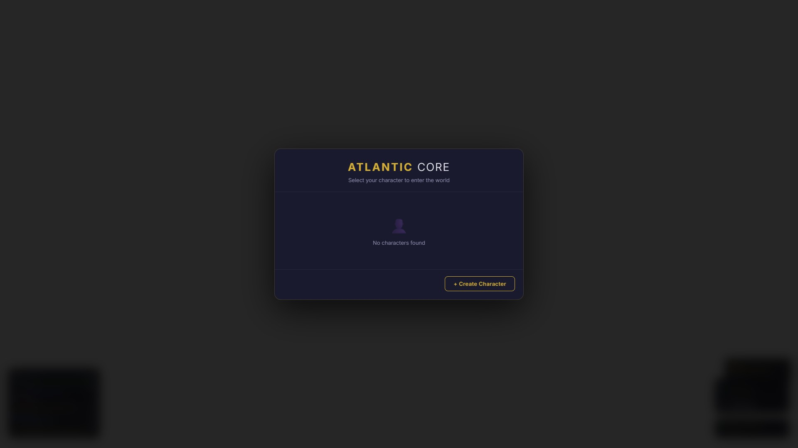<br/>
      <sub><b>Character Select</b> · <code>atc-core</code></sub>
    </td>
    <td width="50%" align="center">
      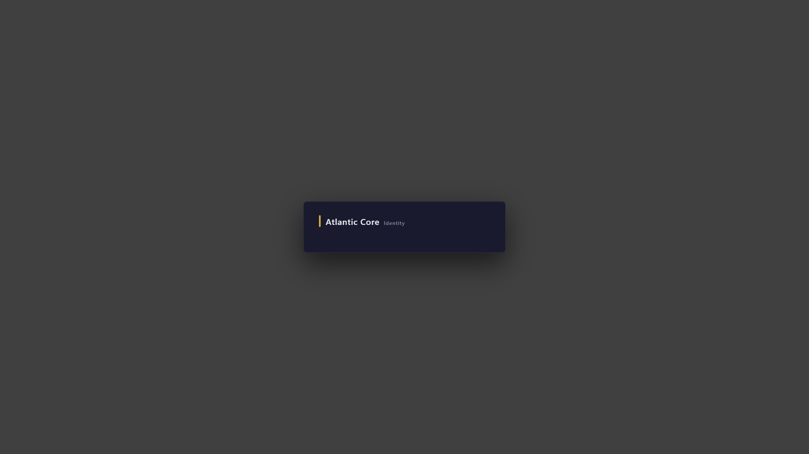<br/>
      <sub><b>Character Creation</b> · <code>atc-identity</code></sub>
    </td>
  </tr>
  <tr>
    <td width="50%" align="center">
      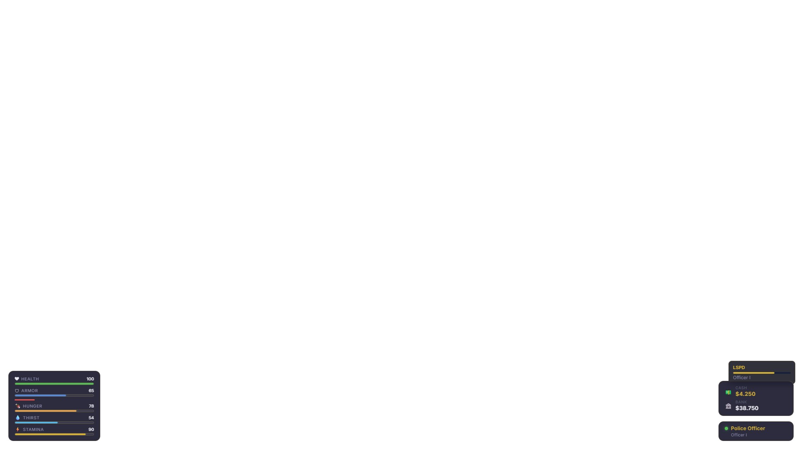<br/>
      <sub><b>In-game HUD</b> — vitals / wallet / job / rep · <code>atc-core</code></sub>
    </td>
    <td width="50%" align="center">
      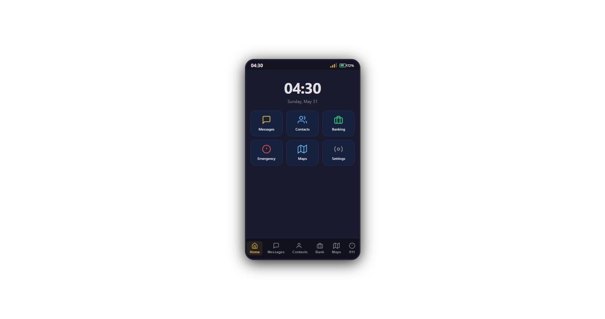<br/>
      <sub><b>Phone</b> — contacts, messages, bank, GPS, 911 · <code>atc-phone</code></sub>
    </td>
  </tr>
  <tr>
    <td width="50%" align="center">
      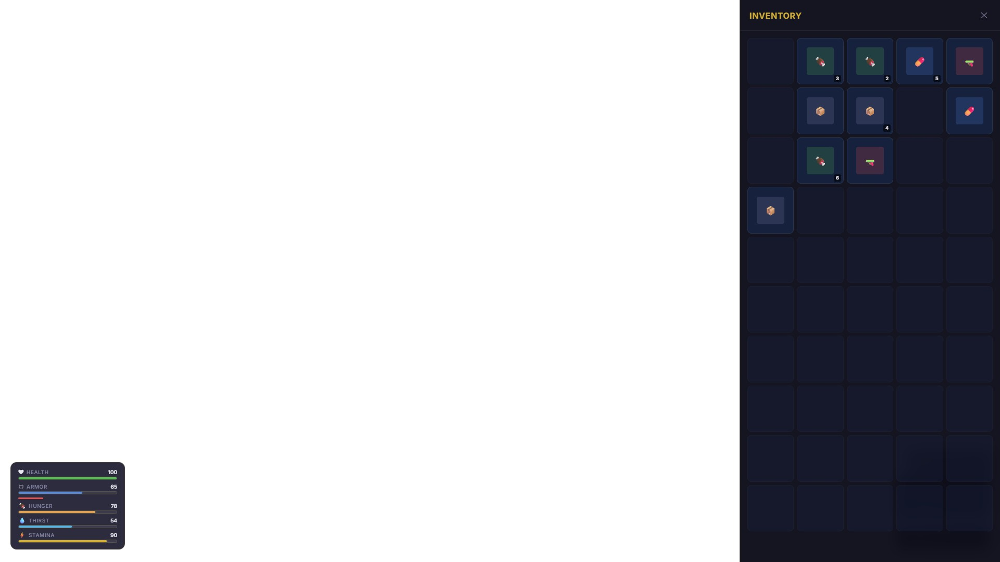<br/>
      <sub><b>Inventory</b> — 5×10 grid, hotbar, drag &amp; drop · <code>atc-core</code></sub>
    </td>
    <td width="50%" align="center">
      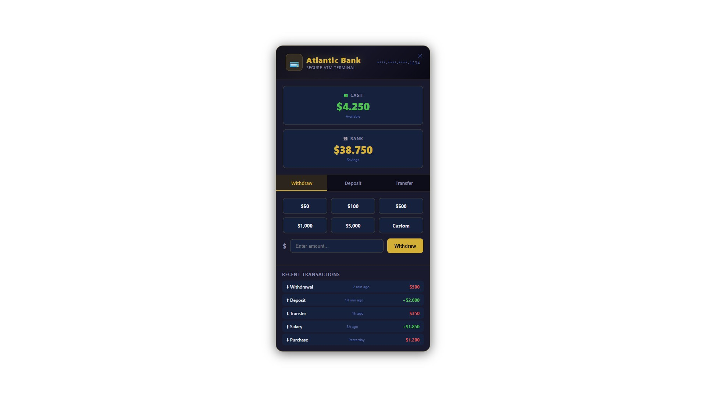<br/>
      <sub><b>Bank / ATM</b> · <code>atc-economy</code></sub>
    </td>
  </tr>
  <tr>
    <td width="50%" align="center">
      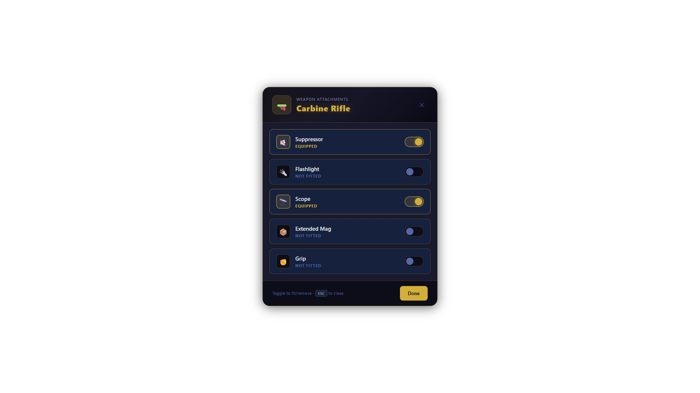<br/>
      <sub><b>Weapon Attachments</b> · <code>atc-combat</code></sub>
    </td>
    <td width="50%" align="center">
      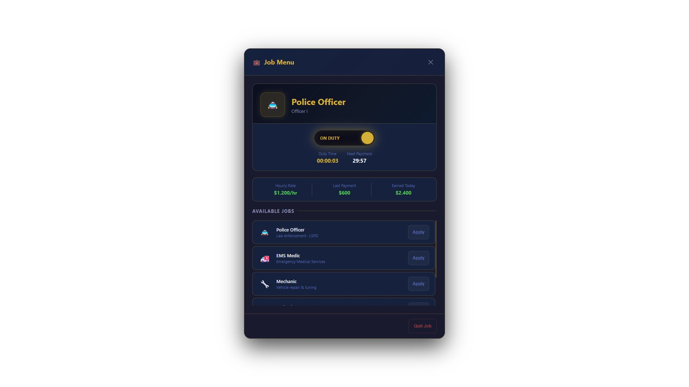<br/>
      <sub><b>Job Menu</b> · <code>atc-jobs</code></sub>
    </td>
  </tr>
  <tr>
    <td width="50%" align="center">
      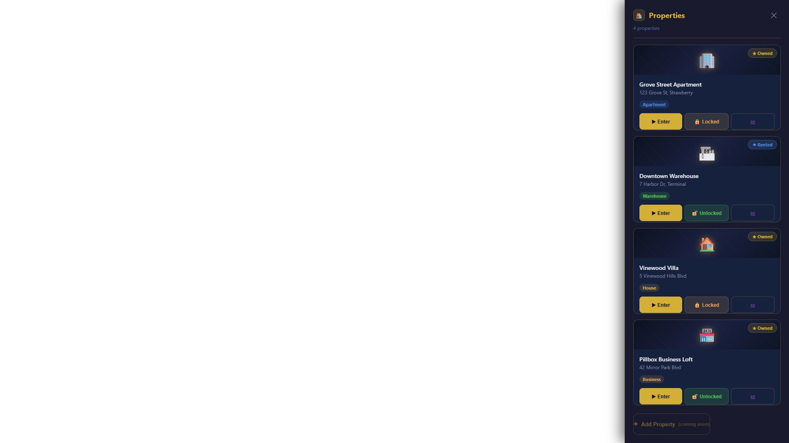<br/>
      <sub><b>Property Manager</b> · <code>atc-housing</code></sub>
    </td>
    <td width="50%" align="center">
      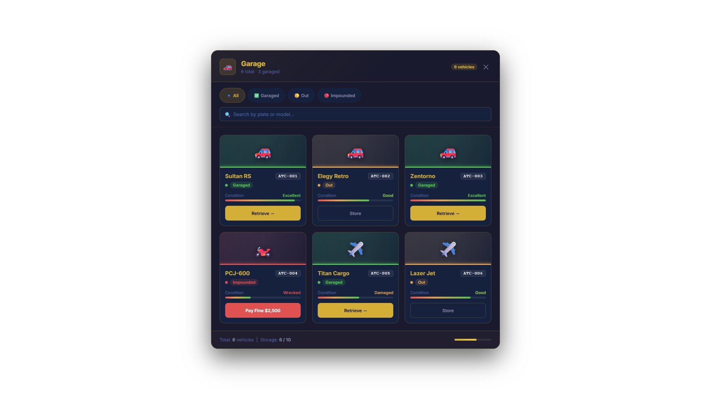<br/>
      <sub><b>Vehicle Garage</b> · <code>atc-vehicles</code></sub>
    </td>
  </tr>
  <tr>
    <td width="50%" align="center">
      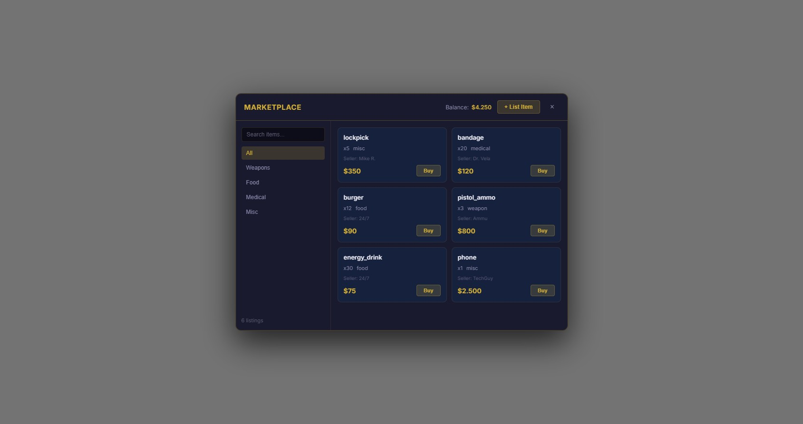<br/>
      <sub><b>Marketplace</b> — player-to-player trading · <code>atc-marketplace</code></sub>
    </td>
    <td width="50%" align="center">
      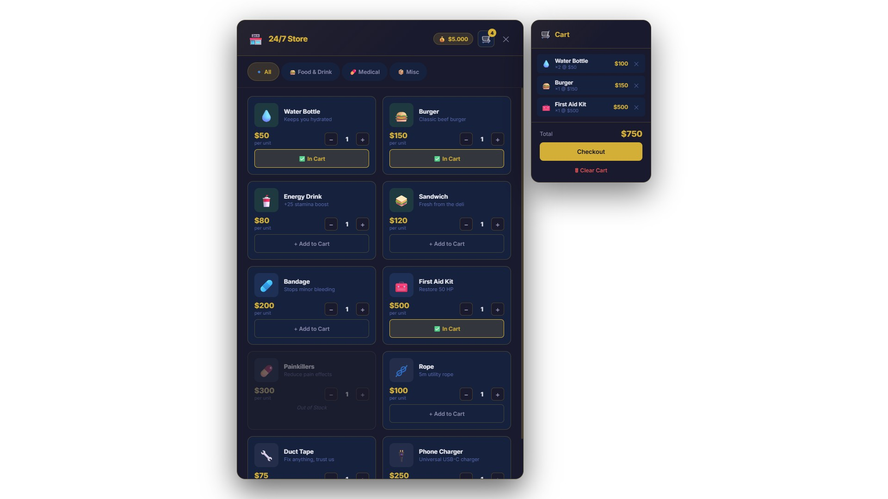<br/>
      <sub><b>24/7 Store</b> · <code>atc-example-shop</code></sub>
    </td>
  </tr>
  <tr>
    <td width="50%" align="center">
      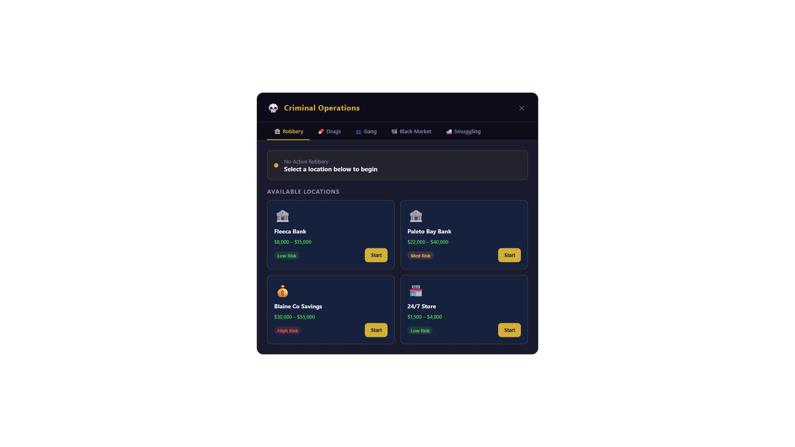<br/>
      <sub><b>Criminal Operations</b> · <code>atc-criminal</code></sub>
    </td>
    <td width="50%" align="center">
      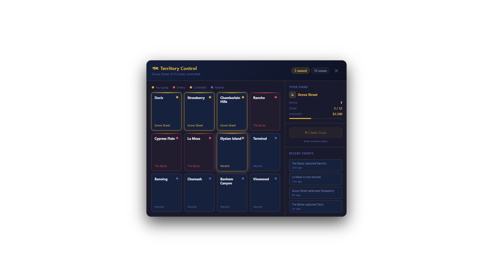<br/>
      <sub><b>Territory Control</b> · <code>atc-territory</code></sub>
    </td>
  </tr>
  <tr>
    <td width="50%" align="center">
      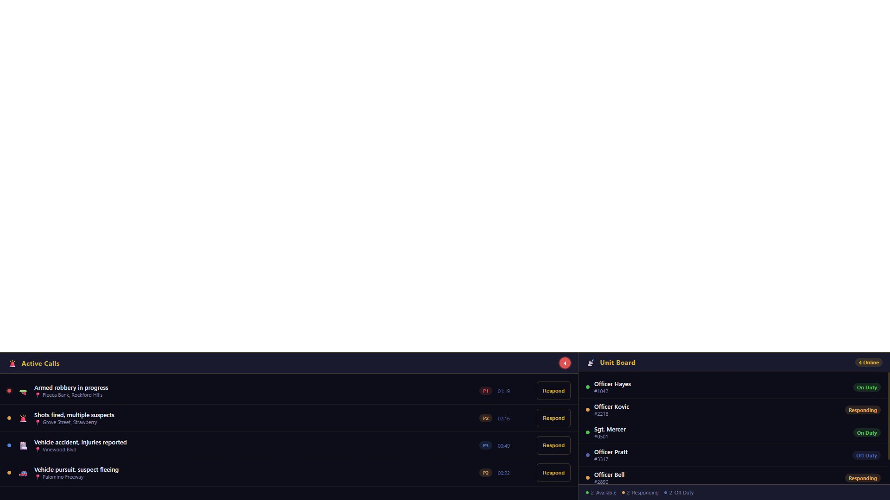<br/>
      <sub><b>Dispatch Terminal</b> · <code>atc-dispatch</code></sub>
    </td>
    <td width="50%" align="center">
      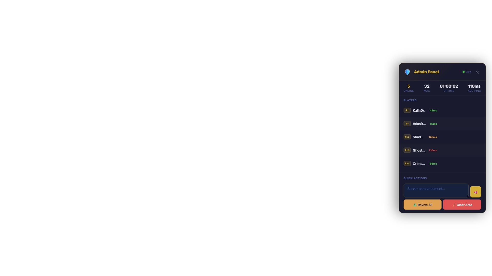<br/>
      <sub><b>Admin Panel</b> · <code>atc-admin</code></sub>
    </td>
  </tr>
</table>

> The **police MDT** (`atc-mdt`, F9) and **EMS** (`atc-ems`, F10) panels are fully
> implemented; live in-game captures are on the way. See
> **[docs/screenshots/](docs/screenshots/)** for the full index.

---

## ✨ Why Atlantic Core

Most FiveM servers are built from dozens of community resources that each keep
their own state, talk to the database their own way, and break in their own
way. ATC takes the opposite approach. It treats your server as one platform:

- **One source of truth.** Player data, money, items, vehicles, and jobs live
  behind a single TypeScript API with a real database (MariaDB) and a fast
  runtime cache (Redis). The game never trusts the client for anything that
  matters.
- **Everything is a plugin.** Identity, inventory, economy, housing, vehicles,
  jobs, police, EMS, crime, the phone, the marketplace — each is a self-contained
  module that talks to the core through one SDK. Turn them on and off in your
  `server.cfg`.
- **A real admin panel.** Manage players, sessions, bans, the economy, and
  server operations from a web dashboard, not from chat commands.
- **Made to build on.** Clear SDK, documented events, a plugin guide, and an
  example plugin so you can add your own gameplay without forking the core.

If you run a server, ATC gives you a solid foundation. If you build for FiveM,
it gives you a clean platform to build on.

---

## 📦 What's in the box

**For players (in-game UI):** character creation, a smartphone (contacts,
messages, banking, GPS, 911), an inventory with hotbar and drag-and-drop, a
vitals/armor/job HUD, an emote wheel, an interaction system, garages, an ATM,
a marketplace, a police MDT, an EMS panel, and more. Every interface is dark,
modern, and responsive from 720p up to 4K.

**For server owners:** Docker setup for the API + MariaDB + Redis + nginx, an
example `server.cfg`, a web admin panel, optional Prometheus/Grafana monitoring,
backup scripts, and an anti-cheat layer.

**For developers:** a typed monorepo (TurboRepo + pnpm) with **84 packages**, an
SDK for Lua and TypeScript, a documented event bus, domain runtime services,
database migrations, a test suite, and compatibility bridges for QBCore and ESX.

> Want the phase-by-phase feature status? See **[TODO.txt](TODO.txt)**.

---

## 🧱 How it fits together

```
   FiveM Client (Lua)            UI, input, rendering (NUI)
        │
   ATC SDK (client)              read-only client state
        │
   ATC Core (Lua server)         game logic, event handling, security
        │
   ATC SDK (server)              service calls
        │
   ATC API (TypeScript)          REST API + business rules (Fastify, Node 22)
        │
   Redis  +  MariaDB             runtime state  +  persistent data
```

The full design — service boundaries, event standards, security model, and the
architecture decision records — lives in
**[docs/architecture/](docs/architecture/)**.

---

## 🧰 Tech stack

| Layer | Technology |
|---|---|
| Game runtime | FiveM, Lua 5.4 |
| API server | Node.js 22, TypeScript 5, Fastify |
| Admin panel | React 19, Tailwind 4, Vite, Zustand |
| Database | MariaDB 11 |
| Cache / runtime state | Redis 7 |
| Monorepo | TurboRepo + pnpm workspaces |
| Infra | Docker, nginx, HAProxy, Prometheus, Grafana |

---

## 🚀 Quick start

You'll need Node.js 22+, pnpm 9+, Docker, and a FiveM (FXServer) install.

**1 — Bring up the backend (database, cache, API):**

```bash
cp infra/.env.example infra/.env      # set your DB and Redis passwords
docker compose -f infra/docker-compose.yml up -d
```

**2 — Install and build the monorepo:**

```bash
pnpm install
pnpm build          # turbo run build
pnpm test           # turbo run test
```

**2b — Set up the database.** Either let the migration runner build it
(`pnpm db:migrate`), or — the simple QBCore/ESX-style way — import the single
schema file **[`database/atc.sql`](database/)** into a fresh `atc` database.
Step-by-step import instructions for Windows in **English, فارسی, Türkçe,
Español, and Deutsch** are in **[database/README.md](database/README.md)**.

**3 — Set up the game server:**

```bash
cp infra/server.cfg.example server.cfg   # fill in your tokens and convars
# Start order in server.cfg: atc-core, atc-sdk, then the plugins you want.
```

The API runs from `apps/api`, and the admin panel from `apps/web`
(`pnpm --filter @atc/web dev`). New to building plugins? Start with
**[docs/sdk/PLUGIN_GUIDE.md](docs/sdk/PLUGIN_GUIDE.md)**.

---

## 📁 Repository layout

| Path | What lives here |
|---|---|
| `apps/` | `api` — Fastify REST API · `web` — React 19 admin panel |
| `packages/` | **84 packages** — shared libs (`db`, `events`, `schemas`, `sdk`, `ui`, `shared-types`, `iam`, `ledger`, `audit`, `locales`, `telemetry`) plus the domain runtimes (economy, jobs, law, medical, vehicles, housing, criminal, world, transport, dispatch, …) |
| `plugins/` | **17 first-party gameplay plugins** (see below) |
| `bridges/` | Compatibility adapters — `esx`, `qb-core` |
| `game/` | FiveM Lua resources — `atc-core` (`client` · `server` · `shared` · NUI `ui`) and `atc-sdk` (`client` · `server` · `shared`) |
| `infra/` | Docker, `nginx`, `monitoring` (Prometheus/Grafana), `scripts` (backup/ops) |
| `database/` | One-file schema (`atc.sql`) + multi-language import guide |
| `docs/` | `architecture/` (18 specs + ADRs), `runbooks/`, `sdk/`, `screenshots/`, `branding/`, `funding.md` |
| `tools/` | Shared config — `eslint-config`, `tsconfig` |

---

## 🎮 Plugins and keybinds

Plugins live in `plugins/` and depend on `atc-core`. The default keys below are
registered with `RegisterKeyMapping`, so players can rebind them in the FiveM
settings menu.

| Plugin | What it does | Default key |
|---|---|---|
| `atc-identity` | Character creation & customization | on join |
| `atc-inventory` | Inventory, item use, crafting | F7 craft · TAB inventory\* |
| `atc-economy` | Money, ATM, shops | F5 ATM |
| `atc-housing` | Property ownership, access, locks | F3 |
| `atc-vehicles` | Garage, spawning, impound | F1 |
| `atc-jobs` | Jobs, duty, payroll | F4 menu · F6 duty |
| `atc-combat` | Death, revive, weapon attachments | F10 attachments |
| `atc-territory` | Faction zone control | F2 map |
| `atc-dispatch` | 911 calls and unit routing | — |
| `atc-admin` | In-game staff tools | F6 menu |
| `atc-phone` | Smartphone: contacts, messages, bank, GPS, 911 | NUMPAD0 |
| `atc-mdt` | Police mobile data terminal | F9 · F12 evidence |
| `atc-ems` | Medical gameplay | F10 patient |
| `atc-criminal` | Robberies, drugs, gangs, smuggling | G gang menu |
| `atc-marketplace` | Player-to-player trading | F8 |
| `atc-example-shop` | Reference plugin using the SDK (24/7 store) | — |
| `atc-plugin-healthcheck` | Runtime health & readiness checks for plugins | — |

\* `TAB` inventory, `B` emote wheel, and `F11` activity browser are part of the
core resource. A couple of defaults overlap (F6, F10) when many plugins run at
once — rebind one per pair in your deployment.

---

## 📚 Documentation

- **[docs/architecture/](docs/architecture/)** — how ATC is designed (18 specs + ADRs)
- **[docs/runbooks/](docs/runbooks/)** — phase-by-phase implementation runbooks
- **[docs/sdk/PLUGIN_GUIDE.md](docs/sdk/PLUGIN_GUIDE.md)** — build your own plugin
- **[docs/sdk/API_REFERENCE.md](docs/sdk/API_REFERENCE.md)** — SDK & API reference
- **[CONTRIBUTING.md](CONTRIBUTING.md)** — how to contribute
- **[THIRD_PARTY.md](THIRD_PARTY.md)** — third-party software & attribution
- **[docs/funding.md](docs/funding.md)** — support & sponsorship guide

---

## 💜 Support this Project

Atlantic Core is an open, source-available platform built and maintained in the
open by **Naiemi Group**. If ATC powers your server, saves you time, or you'd
simply like to see it grow, please consider supporting its development. Your
support goes straight into new plugins, better docs, and long-term maintenance —
and every contribution, big or small, genuinely means a lot. 🙏

<p align="center">
  <a href="https://github.com/sponsors/Kalin0x0">
    
  </a>
  &nbsp;
  <a href="https://ko-fi.com/kalin0x">
    
  </a>
  &nbsp;
  <a href="https://naiemi.com">
    
  </a>
</p>

<p align="center">
  <strong><a href="https://github.com/sponsors/Kalin0x0">❤️ Become a GitHub Sponsor</a></strong>
  &nbsp;·&nbsp;
  <strong><a href="https://ko-fi.com/kalin0x">☕ Buy me a Ko-fi</a></strong>
  &nbsp;·&nbsp;
  <strong><a href="https://naiemi.com">🌐 Other ways to support</a></strong>
</p>

> The repository's **Sponsor** button (top of the page) is powered by
> **[.github/FUNDING.yml](.github/FUNDING.yml)**. More platforms — Buy Me a
> Coffee, Patreon, Open Collective, and PayPal — can be switched on at any time;
> the step-by-step guide is in **[docs/funding.md](docs/funding.md)**.

<!--
  ┌───────────────────────────────────────────────────────────────────────────┐
  │  READY-TO-USE BADGES                                                       │
  │  Uncomment a line below once you add the matching handle to               │
  │  .github/FUNDING.yml, then replace <handle> with your username.           │
  └───────────────────────────────────────────────────────────────────────────┘

  [](https://www.buymeacoffee.com/<handle>)
  [](https://www.patreon.com/<handle>)
  [](https://opencollective.com/<handle>)
  [](https://www.paypal.me/<handle>)
-->

---

## 📄 License

Atlantic Core is an open project by **Naiemi Group**, released under the
**Naiemi Group Open Development License** — see **[LICENSE](LICENSE)**.

In plain terms: you can read the code, run it on your own server (commercial
servers included), and modify it however you like. What you can't do is
redistribute it, re-publish it, or clone it into a separate or competing
product. Improvements are welcome back in the main project — see
[CONTRIBUTING.md](CONTRIBUTING.md).

ATC ships no GTA V game assets. Server operators are responsible for licensing
any assets their deployment needs and for following the FiveM / CitizenFX
Platform Agreement.

---

<div align="center">


**Atlantic Core** · maintained by Naiemi Group

</div>
